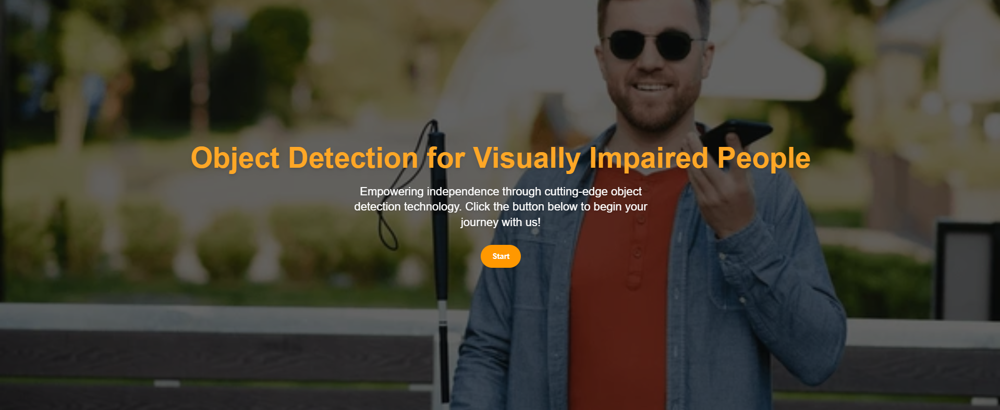
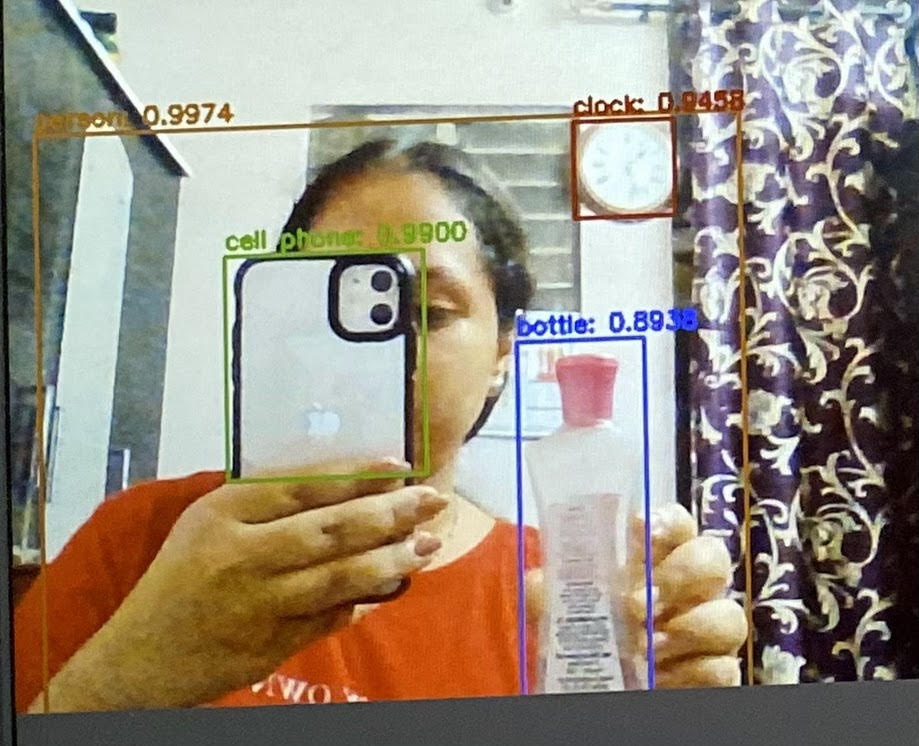

# 🦯 BeMyLens

**BeMyLens** is an intelligent real-time object detection web application designed to assist visually impaired individuals by detecting nearby objects through the webcam and describing them using voice output. It integrates cutting-edge computer vision and accessible web technology to promote independence and spatial awareness.

---

## 🎯 Features

- 🔍 **Real-time Object Detection** using YOLOv3
- 🗣️ **Speech Feedback** via Web Speech API (Text-to-Speech)
- 🎥 **Live Webcam Feed** streamed in-browser
- 🎛️ **Adjustable Voice Controls** (pitch, rate, volume, voice selection)
- 💡 **Clean and Responsive UI** with Tailwind CSS
- 🔁 **Auto-Refresh Detection** every second

---

## 🧰 Tech Stack

| Layer         | Tech Used                  |
|---------------|-----------------------------|
| **Frontend**  | React, Tailwind CSS |
| **Backend**   | Flask, OpenCV |
| **Detection** | YOLOv3 (You Only Look Once)|
| **Voice**     | Web Speech API (Browser TTS) |

---

## 🚀 Getting Started

### 1. Clone the Repository

```bash
git clone https://github.com/kskeertana/BeMyLens.git
cd BeMyLens
```

---

### 2. Backend Setup (Flask + YOLO)

```bash
cd server
pip install -r requirements.txt
python app.py
```

> 📌 **Note:** Place `yolov3.cfg` and `yolov3.weights` inside the `/server` folder.

---

### 3. Frontend Setup (React)

```bash
cd ../client
npm install
npm start
```

Open the browser and navigate to:  
**http://localhost:3000**

---

## 🧪 Testing the App

- Ensure your webcam is connected and accessible by the browser.
- Launch Flask (`http://localhost:5000`) and React (`http://localhost:3000`).
- Navigate to `/` and click **Start** to enter the main interface.
- The app will detect objects and speak them aloud every second.
## 🖼️ Demo Screenshots

<p align="center">
  
  
</p>


---

## 📝 License

This project is licensed under the MIT License – see the [LICENSE](LICENSE) file for details.
